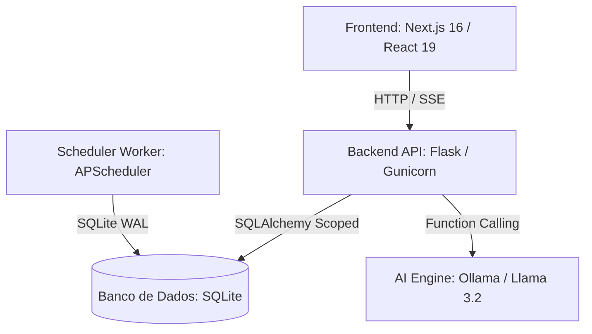

# 📈 AssetFlow Pro

AssetFlow Pro é um sistema integrado de consolidação de investimentos, análise quantitativa de risco e inteligência artificial autônoma para rebalanceamento de carteiras.

O ecossistema é projetado para operar com **latência ultra-baixa**, concorrência robusta no banco de dados SQLite (em modo WAL) e tomadas de decisões orientadas por IA local através do modelo `llama3.2:3b` rodando via Ollama com **Function Calling nativo**.

---

## 🛠️ Arquitetura do Sistema e Stack Tecnológica

O projeto é dividido em três camadas principais containerizadas:



### 1. Frontend (React 19 & Next.js 16)
* **Visualização Fluida:** Grid responsiva, Dark Mode nativo e efeitos de transições acelerados.
* **Sem Input Lag:** Implementação do hook `useTransition` do React 18/19 na barra de pesquisas do [AssetsTable](file:///c:/Users/Fabricio/asset-flow/app/components/AssetsTable.tsx) para manter a digitação síncrona enquanto a filtragem ocorre em background.
* **Desempenho Otimizado (TTI):** Importações dinâmicas (`next/dynamic`) com esqueletos de carregamento para todos os modais e componentes gráficos complexos.
* **Barramento de Saúde:** Componente [HealthIndicator](file:///c:/Users/Fabricio/asset-flow/app/components/HealthIndicator.tsx) monitorando ativamente os microsserviços a cada 15 segundos.

### 2. Backend API (Flask / Python 3.11)
* **Gunicorn Threaded:** Execução sob servidor Gunicorn configurado para alocação eficiente de threads concorrentes.
* **Banco de Dados Concorrente (WAL):** Configurado com pragmas de produção (Write-Ahead Logging, Cache de 32MB e `synchronous=NORMAL`) no [models.py](file:///c:/Users/Fabricio/asset-flow/database/models.py) do SQLAlchemy para suportar leituras livres em concorrência com a escrita.
* **Migrações Controladas:** Histórico de migrações estruturais gerenciado deterministicamente via **Alembic**.

### 3. Worker (Background Engine)
* **Scheduler Isolado:** Executa tarefas em segundo plano agendadas via `APScheduler` para download periódico de cotações, checks de dividendos e aquecimento do cache de riscos.
* **Sincronia de Índices:** Atualização autônoma de cotações de referência da B3 (Ibovespa e IFIX).

---

## 🧮 Motor Quantitativo de Riscos

O ecossistema financeiro substitui aproximações estáticas por modelagens dinâmicas de nível institucional:
1. **EWMA (Exponentially Weighted Moving Average):** Matrizes de covariância e correlação dinâmicas usando fator de decaimento $\lambda = 0.94$ (padrão RiskMetrics), capturando aglomerações de volatilidade do mercado.
2. **Cornish-Fisher VaR & CVaR:** Value at Risk a 95% ajustado matematicamente pela assimetria (*Skewness*) e excesso de curtose (*Kurtosis*) dos retornos reais da carteira do investidor.
3. **Pandas Market Calendars:** Alinhamento temporal preciso das cotações considerando os dias úteis oficiais da B3 (`BMF`), eliminando distorções estatísticas em feriados de ativos internacionais.

---

## 🤖 Jarvis Agent: Function Calling Autônomo

O assistente **Jarvis** não apenas responde dúvidas, mas atua como um agente autônomo conectado ao Python por meio de **Function Calling** nativo:
* **`query_portfolio_metrics`:** Devolve o status quantitativo de risco e alocação do portfólio.
* **`get_asset_fundamental_data(ticker)`:** Extrai demonstrativos financeiros e indicadores de múltiplos direto da CVM.

---

## 🚀 Como Inicializar o Projeto (Ambiente Docker)

Toda a infraestrutura pode ser iniciada localmente com um único comando:

```bash
docker compose down
docker compose up -d --build
```

Os serviços expostos são:
* **Frontend:** [http://localhost:3000](http://localhost:3000)
* **Backend API:** [http://localhost:5328/api/health](http://localhost:5328/api/health)
* **Ollama Service:** [http://localhost:11434](http://localhost:11434)

---

## 🧭 Documentação Adicional do Repositório

Para detalhes específicos sobre cada subsistema, consulte os READMEs internos:
* 🖥️ [Frontend Web App](file:///c:/Users/Fabricio/asset-flow/app/README.md)
* ⚙️ [Servidor Backend](file:///c:/Users/Fabricio/asset-flow/server/README.md)
* 💾 [Camada de Banco de Dados](file:///c:/Users/Fabricio/asset-flow/database/README.md)
* 🗺️ [Roteiro de Desenvolvimento (ROADMAP)](file:///c:/Users/Fabricio/asset-flow/ROADMAP.md)
